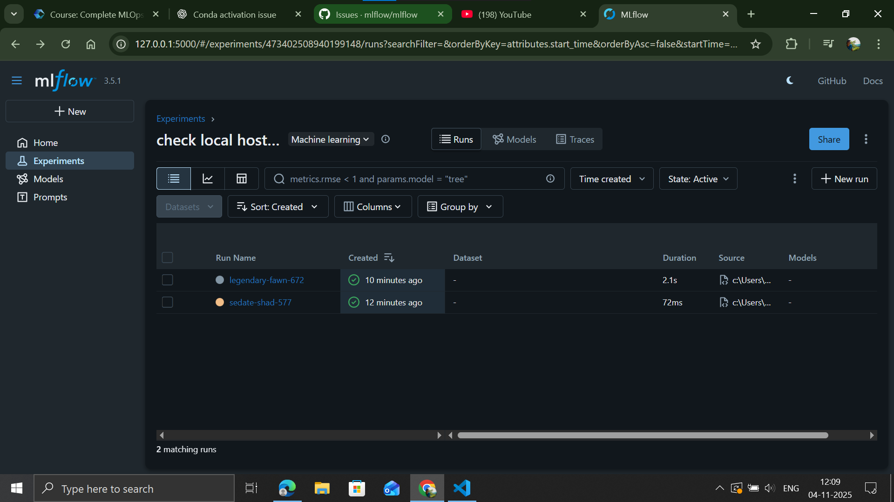
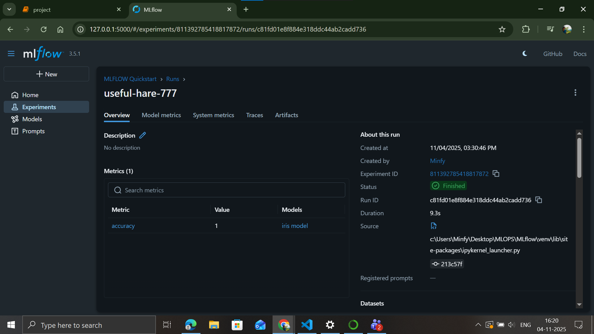

visualization, experiment tracking, gen AI, observability, models, evaluation

open source, can integrate with any ml liabrary(tf, sklearn, keras etc)

- uses
* Data science use->
1) experimental tracking (metrics)
2) code structuring
3) model packing and dependency management
4) evaluating hyperparameter tuning
5) compare results of diff models

* MLOPS professional use->
1) manage lifecycle of models both pre and post development
2) deploy models securely to production env
3) manage deployment dependencies

* Prompt engineering users->
1) evaluate and experiment llms
2) experiment with custom prompts
3) decide on the best base model

over all->
1) experiment tracking
2) model selection and deployment
3) model performance monitor
4) collabrate

- create seperate env: conda create -p venv python==3.10
    to activate: conda init
                 conda activate venv/

set-up->

tracking->
